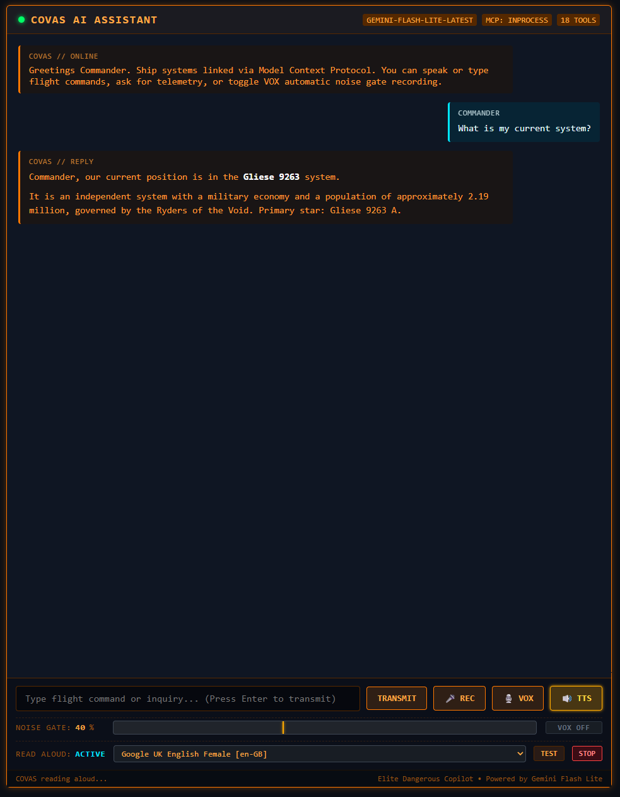
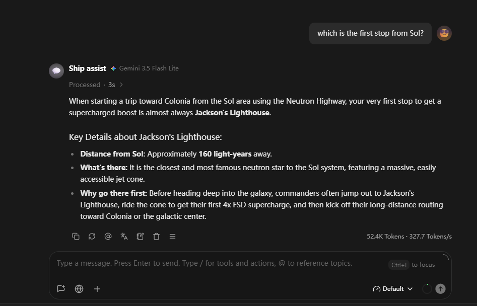
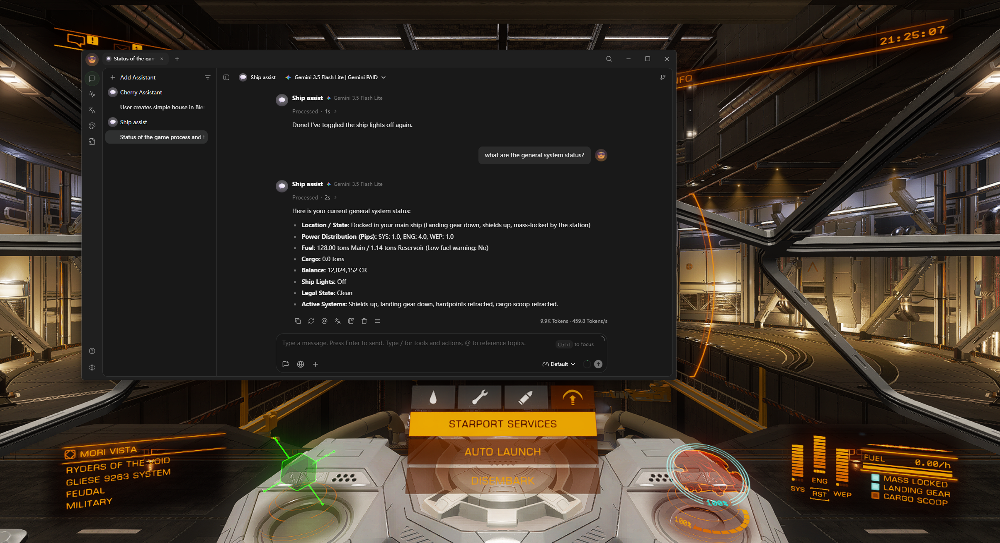

# ed-assist

A lightweight, cross-platform Go helper for **Elite Dangerous** that monitors, reads, and parses `Status.json` in real time.

---

## Features

- **Event-Driven & Polling Modes**:
  - **Watch Mode (`watch`, default)**: Uses OS filesystem notifications (`fsnotify` / `ReadDirectoryChangesW` on Windows, `inotify` on Linux). Consumes **0% CPU and zero disk I/O** when idle, docked, or paused.
  - **Poll Mode (`poll`)**: Periodically reads status every 1/4 second (250ms) or a customized interval.
- **Windows File-Lock Resilience**:
  - Quick-retry loop with configurable delay (e.g. 25ms, up to 3 retries) automatically handles transient `ERROR_SHARING_VIOLATION` locks and in-flight file writes by the game.
- **Full Status Parsing**:
  - **Ship & SRV Status**: Unpacks all 32 `Flags` (Docked, Landed, Landing Gear, Shields Up, Supercruise, Flight Assist, Hardpoints, Silent Running, Fuel Scooping, FSD Charging/Cooldown, SRV states, etc.).
  - **Odyssey On-Foot Status**: Unpacks `Flags2` (On-Foot, In Taxi, In Multicrew, Oxygen, Health, Temperature, Gravity, Selected Weapon).
  - **Cockpit Systems**: Power distribution (`Pips`: SYS, ENG, WEP in half-pips), `Fuel` (Main and Reservoir in tons), `Cargo` mass, and `GuiFocus` menus.
  - **Navigation & Planetary**: Latitude, Longitude, Altitude, Heading, Body Name, Balance, and Destination target.
- **System & Destination Tracking (SQLite)**:
  - Automatically records the **latest 100 visited star systems** (with coordinates, economy, allegiance, population, jump distance from journal logs).
  - Automatically records the **latest 100 targeted systems/destinations** from cockpit nav targets.
  - Persisted locally in an **SQLite database (`ed_assist.db`)** located next to the binary with automatic pruning.
- **Model Context Protocol (MCP) Server**:
  - Exposes all Elite Dangerous game status via standard MCP.
  - Supports dual transport modes: **`stdio`** (for Claude Desktop local commands) and **`http` (Server-Sent Events / SSE)** with concurrent live terminal event logging.
  - Works out-of-the-box with AI assistants and IDEs (Cursor, Claude Desktop, Antigravity, custom agents).
  - Exposes 10 tools and 5 resources covering telemetry, navigation, on-foot metrics, travel history, and ship controls.
- **In-Game Ship & Cockpit Control**:
  - Automatically parses player's active `.binds` XML file to resolve key mappings and modifiers.
  - Sends DirectInput hardware scancodes via Windows `SendInput` with configurable hold duration (`key_hold_ms`).
  - Allows AI copilots to toggle landing gear, hardpoints, lights, night vision, boost, FSD, targeting, and power distribution (pips).
- **Standalone Web Cockpit Assistant (COVAS)**:
  - Built-in self-hosted web HUD (`ed-assist-web`) with text and voice input.
  - Automatic VOX noise gate with live audio VU-meter and silence auto-transmission.
  - Multi-turn AI copilot powered by Google Gemini (`gemini-flash-lite-latest`) with full MCP function calling.
  - Client-side Markdown rendering (bold, italic, code blocks, lists) and structured server-side INFO logging.
- **Flexible Configuration**:
  - Configurable via `config.ini` located next to the binary or in the working directory.
  - Automatically determines the default Elite Dangerous path on Windows and Linux if unconfigured.
  - Full CLI flag overrides for quick adjustments.

---

## Why ed-assist? (Comparison with Existing Tools)

The Elite Dangerous community has built incredible software over the years. However, most established tools were conceived before modern AI protocols existed and often come with heavy runtime dependencies, complex graphical interfaces, or proprietary plugin systems.

`ed-assist` was designed from the ground up around a distinct philosophy: **minimalist, modular, AI-native, and self-contained**.

### At a Glance: Tool Comparison

| Feature | **ed-assist** | **EDMC** | **EDDI** | **VoiceAttack + HCS** | **EDDiscovery** |
|---|---|---|---|---|---|
| **Architecture** | **Single standalone Go binary** | Python + Tkinter GUI | Large .NET / C# application | Closed-source Windows app ($) | Heavy .NET desktop app |
| **Runtime Dependencies** | **None** (pure Go, CGO-free) | Python runtime + pip packages | .NET Framework / Desktop Runtime | Windows SAPI / macro engine | .NET Runtime + database engines |
| **Memory Footprint** | **~10–20 MB RAM** | ~60–120 MB RAM | ~150–350 MB RAM | ~80–150 MB RAM | ~300 MB–1+ GB RAM |
| **Idle CPU Usage** | **0% CPU** (OS filesystem events) | Polling / timer loops | Event hooks + speech synthesis loops | Audio listening loop | Polling + database sync |
| **AI Integration** | **Native MCP Server** (`stdio` & `http`/SSE) | None (REST / bespoke plugins only) | Speech responders only | Macro script triggers | None |
| **Two-Way Control** | **Yes** (DirectInput scancodes from `.binds`) | No (telemetry / upload only) | No (voice responses only) | Yes (pre-recorded macros) | No (read-only telemetry) |
| **System Tracking** | **Lightweight local SQLite** (latest 100) | Cloud relay (EDDN/Inara) | Internal SQLite / DB | None | Massive multi-GB local history DB |
| **Cross-Platform** | **Windows & Linux** (native & Proton) | Windows, Linux, macOS | Windows-centric | Windows only | Windows (Linux experimental) |

### Key Differentiators

1. **AI-Native via Open MCP Standard**
   - Implements the official [Model Context Protocol (MCP)](https://modelcontextprotocol.io/).
   - Connects directly to modern LLMs (Claude Desktop, Cursor, local Ollama/vLLM agents) without proprietary scripting languages or bespoke middleware.
   - Dual transport support: runs headless over `stdio` or as a background HTTP/SSE service (`mcp_transport = http`) so your terminal continues to display live formatted game event logs in real time.

2. **Modular & Composable**
   - Follows the Unix philosophy: do one thing exceptionally well.
   - Built as an interoperable building block that can be combined with other MCP servers (web search, notes, market calculators, custom voice agents) or custom frontends.

3. **True Two-Way Ship Interaction**
   - Most community tools only *read* game data. `ed-assist` bridges telemetry with execution:
   - Reads and auto-detects the player's active `.binds` XML file.
   - Translates high-level actions (`landing_gear`, `hardpoints`, `pips_sys`, `fsd`, `target`, etc.) into hardware DirectInput scancodes with microsecond-level hold timing (`key_hold_ms`).

4. **Zero-Dependency Single Binary**
   - Built in pure Go with an embedded pure-Go SQLite driver (`modernc.org/sqlite`).
   - No CGO, no Python environments, no .NET runtimes, no DLL hell. Download a single executable (`ed-assist` or `ed-assist.exe`), drop in a `config.ini`, and start flying.

5. **Future-Ready Roadmap**
   - Designed to grow incrementally with planned modular additions:
     - Proactive in-cockpit audio & text alarms based on real-time telemetry & Journal events.
     - Real-time commodity trading & market opportunity alerts.
     - Optional offline neural TTS copilot output (e.g. Piper TTS / Windows SAPI).

---

## Installation & Building

Requires **Go 1.24+** (and GNU `make` optionally).

### Build with `make`

```bash
# Build native CLI binary for host OS (into bin/ed-assist)
make build

# Build web cockpit assistant (into bin/ed-assist-web)
make build-web

# Cross-compile Windows 64-bit binaries (bin/ed-assist.exe & bin/ed-assist-web.exe)
make windows

# Cross-compile Windows ARM64 binaries
make windows-arm64

# Build for Linux 64-bit (bin/ed-assist-linux-amd64 & bin/ed-assist-web-linux-amd64)
make linux

# Run unit tests
make test

# Clean build artifacts
make clean
```

### Direct Go Build

```bash
# CLI binary
go build -o ed-assist ./cmd/ed-assist

# Web cockpit assistant
go build -o ed-assist-web ./cmd/ed-assist-web

# Windows cross-compilation
GOOS=windows GOARCH=amd64 go build -ldflags="-s -w" -o ed-assist.exe ./cmd/ed-assist
GOOS=windows GOARCH=amd64 go build -ldflags="-s -w" -o ed-assist-web.exe ./cmd/ed-assist-web
```

---

## Usage

Run `ed-assist` directly:

```bash
./ed-assist
```

On startup, `ed-assist` logs its configuration and the resolved path to `Status.json`:

```text
time=... level=INFO msg="starting ed-assist" mode=watch poll_interval=250ms max_retries=3 retry_delay=25ms
time=... level=INFO msg="expected status file path" path="..." source="auto-determined"
```

When an update is detected, it displays a formatted summary:

```text
--------------------------------------------------------------------------------
[2024-03-01T12:00:00Z] Mode: Ship | GUI: Station Services | FireGroup: 0
  Pips: [SYS: 2.0 | ENG: 2.0 | WEP: 2.0] | Fuel: Main 32.00t / Res 0.85t | Cargo: 12.5t
  Legal State: Clean | Balance: 542000100 CR
  Destination: Sol (Body: 1, System: 12345678)
  Flags: Docked, LandingGearDown, ShieldsUp, FSDMassLocked, InMainShip
--------------------------------------------------------------------------------
```

---

## Configuration

### Command Line Flags

| Flag | Type | Default | Description |
|---|---|---|---|
| `-mode` | `string` | `watch` | Update mode: `watch` (event-driven) or `poll` (ticker) |
| `-interval` | `duration` | `250ms` | Polling interval when `-mode poll` is selected |
| `-retries` | `int` | `3` | Maximum quick retries on read/parse failure |
| `-retry-delay` | `duration` | `25ms` | Delay time between quick retries (e.g. `25ms`, `50ms`) |
| `-track` | `bool` | `false` | Enable optional SQLite tracking of visited and targeted systems (alias: `-tracking`) |
| `-cache-hours` | `int` | `8` | Galaxy intelligence API cache TTL in hours for EDSM/Spansh queries (backed by SQLite) |
| `-db` | `string` | `""` | Path to SQLite database file (default: `ed_assist.db` next to binary) |
| `-status` | `string` | `""` | Direct override for the `Status.json` path |
| `-config` | `string` | `""` | Path to custom `config.ini` |
| `-loglevel` | `string` | `info` | Log level: `debug`, `info`, `warn`, `error` |
| `-logfile` | `string` | `""` | Optional file to mirror log output to |

### `config.ini`

Place a `config.ini` next to the binary or in the current working directory (see [`config.ini.example`](file:///home/gerifield/ed-assist/config.ini.example)):

```ini
[general]
; Custom path to Status.json (leave empty for auto-detection)
status_file = 

; Optional system tracking (latest 100 visited systems & 100 targeted destinations in SQLite)
enable_tracking = false

; SQLite database path for visited and targeted tracking (default: ed_assist.db next to binary)
db_path = 

; Detection mode: "watch" (event-driven) or "poll" (periodic)
mode = watch

; Polling interval in ms (active when mode = poll)
poll_interval_ms = 250

; Quick retry attempts and delay (e.g. 25ms, 50ms)
max_retries = 3
retry_time_ms = 25

; Enable MCP server mode
enable_mcp = false

; MCP transport: "stdio" or "http" (default: "stdio")
; In "http" mode, live terminal events and logs remain active while serving MCP over HTTP/SSE
mcp_transport = stdio

; HTTP listen address when mcp_transport = http (default: 127.0.0.1:8080)
mcp_addr = 127.0.0.1:8080

; Optional in-game control via DirectInput hardware scancodes and active .binds file
; Enables MCP tools send_game_command and list_game_commands
game_control = false

; Key press hold duration in ms (default: 80ms)
key_hold_ms = 80

; Custom path to Elite Dangerous Bindings folder or .binds file (optional)
bindings_path = 

; Logging
loglevel = info
; logfile = ed-assist.log

; Web Cockpit Assistant & Gemini API Configuration (for ed-assist-web)
; Web UI listen address and port (default: 127.0.0.1:3000)
web_addr = 127.0.0.1:3000

; Google Gemini API key (or export GEMINI_API_KEY environment variable)
gemini_api_key = 

; Gemini model for reasoning (default: gemini-flash-lite-latest)
gemini_model = gemini-flash-lite-latest

; Custom system instruction prompt for COVAS / Gemini assistant.
; If omitted or empty, ed-assist uses the default Elite Dangerous COVAS cockpit prompt.
; Accepts prompt text directly (single line or indented multi-line) or path to a text file (e.g. prompt.txt)
system_prompt = 

; MCP connection mode: "inprocess" (all-in-one), "http" (SSE), or "stdio"
gemini_mcp_mode = inprocess

; MCP endpoint URL or binary path when mode is http or stdio
gemini_mcp_endpoint = http://127.0.0.1:8080/sse

; Automatic VOX Noise Gate threshold (0 - 100, default: 40)
voice_gate_threshold = 40

; Silence duration in ms before auto-transmitting voice recording (default: 2000ms)
voice_silence_ms = 2000

; Acoustic echo protection: automatically suppress VOX trigger while COVAS speaks (default: true)
voice_echo_protection = true

; Galaxy intelligence external API cache time in hours (EDSM / Spansh, default: 8 hours)
system_cache_hours = 8
```

---

## Model Context Protocol (MCP) Server

When configured with `enable_mcp = true` in `config.ini`, `ed-assist` runs an MCP server exposing real-time Elite Dangerous status, system history, and in-game controls to AI assistants.

### Transport Modes

`ed-assist` supports two MCP transport protocols selectable via `mcp_transport` in `config.ini`:

1. **`http` (Recommended for interactive play)**:
   - Starts an HTTP server supporting **Server-Sent Events (SSE)** at `http://127.0.0.1:8080/sse`.
   - **Full Terminal Event Logging**: The running terminal continues to print live formatted game status updates and event logs as you fly.
   - MCP clients (Cursor, web dashboards, remote agents) connect over HTTP.

2. **`stdio` (Default)**:
   - Operates over standard input and output streams (`stdin`/`stdout`).
   - Suitable when spawned directly as a subprocess by local desktop applications (like Claude Desktop).

### Running with MCP

Set `enable_mcp = true` in `config.ini` and launch `ed-assist`:
```bash
./ed-assist
```
Or specify a dedicated config file:
```bash
./ed-assist -config /path/to/mcp-config.ini
```

### Client Configuration Examples

#### HTTP / SSE Transport (Cursor / remote MCP clients)
```json
{
  "mcpServers": {
    "ed-assist": {
      "url": "http://127.0.0.1:8080/sse"
    }
  }
}
```

#### Stdio Transport (Claude Desktop local command)
```json
{
  "mcpServers": {
    "ed-assist": {
      "command": "/path/to/ed-assist"
    }
  }
}
```

### Exposed MCP Tools (18 Tools)

#### Cockpit Telemetry & History
| Tool | Description |
|---|---|
| `get_status` | Returns the complete status as JSON (ship, cockpit, coordinates, destination, balance, flags). |
| `get_status_summary` | Returns a human-readable formatted text summary of the current state. |
| `get_ship_status` | Returns flight mode (Ship/SRV/Fighter/On Foot), legal state, and all active status flags. |
| `get_cockpit` | Returns power pips (SYS, ENG, WEP), fuel (Main and Reservoir in tons), cargo mass, and GUI focus screen. |
| `get_navigation` | Returns body name, latitude, longitude, altitude, heading, planet radius, and targeted destination. |
| `get_on_foot` | Returns Odyssey on-foot metrics: health, oxygen, temperature, gravity, weapon, and on-foot flags. |
| `get_visited_systems` | Returns the latest visited star systems history (up to 100) from the SQLite database. |
| `get_targeted_systems` | Returns the latest targeted star systems/destinations history (up to 100) from the SQLite database. |

#### In-Game Control (DirectInput)
| Tool | Description |
|---|---|
| `send_game_command` | Sends a discrete flight or cockpit command via DirectInput hardware scancodes (`landing_gear`, `hardpoints`, `cargo_scoop`, `lights`, `night_vision`, `boost`, `fsd`, `target`, `pips_sys`, `pips_eng`, `pips_wep`, `pips_reset`, etc.). |
| `list_game_commands` | Lists all available in-game actions and key bindings mapped from the player's active `.binds` file. |

#### Galaxy Intelligence & Navigation (EDSM & Spansh with SQLite Caching)
| Tool | Description |
|---|---|
| `search_system` | Look up star system coordinates, allegiance, government, economy, security, population, and controlling faction. Defaults to current target destination or current system if omitted. |
| `nearest_systems` | Find systems nearest to a target system or 3D coordinates `(x, y, z)` within a given radius in light years (optional `only_populated` filter). |
| `system_stations` | List all stations, starports, planetary outposts, settlement types, distances from arrival star, and services in a system. |
| `station_market` | Retrieve commodity market prices (buy/sell price, stock, demand) for a specific station, with optional commodity filter. |
| `system_factions` | Get minor factions in a system, their influence levels, government types, state, and happiness. |
| `system_bodies` | List celestial bodies (stars, planets, moons) in a system, including terraformability, volcanism, and atmosphere. |
| `plot_neutron_route` | Calculate a high-speed neutron star highway jump route between two systems using the Spansh router API. |
| `get_server_status` | Get the current Elite Dangerous game server status and message of the day from Frontier / EDSM. |

> [!TIP]
> **Galaxy Intelligence Caching**: All external galaxy queries are persistently cached in the SQLite database (`api_cache` table) with a configurable TTL (default: 8 hours, set via `system_cache_hours` in `config.ini` or `-cache-hours` CLI flag). Repeated questions or tool lookups respond in sub-millisecond time without hammering external community APIs.

### Exposed MCP Resources

| Resource URI | MIME Type | Description |
|---|---|---|
| `ed://status/current` | `application/json` | Raw JSON of latest status snapshot. |
| `ed://status/summary` | `text/plain` | Clean text summary of current status. |
| `ed://systems/visited` | `application/json` | JSON list of up to 100 latest visited star systems. |
| `ed://systems/targeted` | `application/json` | JSON list of up to 100 latest targeted destinations. |
| `ed://controls/commands` | `application/json` | JSON list of all configured keyboard commands and aliases loaded from `.binds`. |

---

## Web Cockpit Assistant (COVAS)

`ed-assist-web` is a standalone web application providing an in-cockpit AI voice & text copilot (**COVAS** = *Cockpit Voice Assistant*) powered by Google Gemini (default: `gemini-flash-lite-latest`) and integrated with the MCP server tools.

### Features
- **Minimal, responsive dark HUD**: Built with pure HTML5 and vanilla JavaScript (zero frontend dependencies or node build steps).
- **Rich In-Browser Markdown Parsing**:
  - Safe, XSS-protected client-side formatter.
  - Automatically parses `**bold**`, `*italic*`, `` `inline code` ``, ```` ```code blocks``` ````, bullet/numbered lists, and clean paragraph breaks styled to match the orange/cyan cockpit aesthetic.
- **Manual & Automatic Voice Commands**:
  - **Manual Push-to-Record (`REC`)**: Click to start recording cockpit voice, click `STOP` to encode and transmit.
  - **Automatic Noise Gate (`VOX`)**: Real-time voice activity detection with interactive threshold slider (default: 40%) and live input volume visualizer. When speaking above the threshold, recording automatically triggers (slider glows red); when silence is detected for the configured duration (default: 2s, set via `voice_silence_ms`), the audio is automatically transmitted to Gemini, while the VOX listener remains active for the next command.
- **Read Aloud Voice Output (Browser Web Speech API)**:
  - Hands-free audio responses spoken directly by the browser using the Web Speech API (zero external dependencies).
  - Interactive **TTS toggle button** (`🔊 TTS`) to activate or deactivate voice synthesis (saved in `localStorage`).
  - **Voice Preset Dropdown**: Organizes voices supported by the browser into primary language groups (English with authentic UK/US/Int choices, Magyar, Deutsch, Français, Español, and other system voices).
  - **Clean Speech Markdown Parsing**: Automatically strips formatting syntax (`**bold**`, `*italic*`, code blocks, backticks, list bullets, etc.) so speech sounds clean and natural.
  - **Acoustic Echo & Feedback Prevention**: The VOX noise gate automatically pauses while COVAS is speaking, eliminating microphone loopback through speakers.
  - **Voice Test & Stop Controls**: Includes a `TEST` button to preview any selected voice and a `STOP` button to cancel speech on demand.
- **Scroll-to-Bottom Conversation Stream**: Displays full commander inquiries and COVAS responses in chronological order, automatically scrolling to the latest message.
- **Structured Server Logging**:
  - Emits clean, structured `slog` INFO messages on every incoming command and completion:
    ```text
    time=... level=INFO msg="received user command" prompt="what time is it?" has_audio=false
    time=... level=INFO msg="command completed successfully" reply_len=142
    ```
- **Gemini Reasoning & Tool State**:
  - Full multi-turn function calling with cryptographic `thought_signature` preservation across tool execution turns.
- **Flexible MCP Connectivity**:
  - `inprocess` (default): All-in-one execution running telemetry reader, SQLite storage, DirectInput game control, and MCP tools directly in the web binary.
  - `http`: Connects to an external `ed-assist` server serving MCP over HTTP/SSE.
  - `stdio`: Spawns a local `ed-assist` binary subprocess over stdin/stdout.

### Launching `ed-assist-web`
```bash
# Set your Gemini API key (or add gemini_api_key to config.ini)
export GEMINI_API_KEY="your-gemini-api-key"

# Build and run
make build-web
./bin/ed-assist-web
```
Open your browser at `http://127.0.0.1:3000`.

### Command Line Flags (`ed-assist-web`)

| Flag | Type | Default | Description |
|---|---|---|---|
| `-addr` | `string` | `127.0.0.1:3000` | HTTP listen address and port for the web UI |
| `-model` | `string` | `gemini-flash-lite-latest` | Gemini model name |
| `-mcp-mode` | `string` | `inprocess` | MCP transport mode: `inprocess`, `http`, or `stdio` |
| `-mcp-endpoint` | `string` | `http://127.0.0.1:8080/sse` | MCP endpoint URL (for `http`) or binary path (for `stdio`) |
| `-api-key` | `string` | `""` | Gemini API key (or `GEMINI_API_KEY` env) |
| `-status` | `string` | `""` | Override path to `Status.json` |
| `-db` | `string` | `""` | Path to SQLite database file |
| `-cache-hours` | `int` | `8` | Galaxy intelligence API cache TTL in hours for EDSM/Spansh queries (backed by SQLite) |
| `-config` | `string` | `""` | Path to custom `config.ini` |
| `-loglevel` | `string` | `info` | Log level: `debug`, `info`, `warn`, `error` |
| `-version` | `bool` | `false` | Print version information and exit |

---

## Planned Features & Roadmap

### Proactive Telemetry & Journal Event Triggers
- **Autonomous In-Cockpit Audio & Text Alerts**:
  - Monitors `Status.json` flags and Journal entries to proactively alert the commander without requiring a question:
    - **Combat & Defensive Alerts**: Under attack, shields offline, critical hull integrity drops (<50%, <25%), critical heat levels.
    - **Interdiction**: Immediate interdiction alert with advice on escape vector or submission.
    - **Fuel & Route Safety**: Low fuel alarms; fuel scoop alerts; warnings if jumping to an un-scoopable star (KGBFOAM filter check).
    - **Flight Operations**: Landing gear reminder during station approach or low-altitude planetary flight; docking clearance confirmation.
    - **Exploration & Navigation**: High-value cartographic discoveries, orbital cruise entry notifications.
- **Proactive Push Architecture**:
  - Server-Sent Events (SSE) or WebSocket push channel streaming real-time alerts from the telemetry engine directly into the web HUD.

---

## Gallery

### Web Cockpit Assistant HUD (`ed-assist-web`)

| Web Cockpit Assistant UI | Galaxy Intelligence & System Telemetry |
|:---:|:---:|
|  |  |
| *Voice-enabled cockpit HUD with live audio VU-meter, Read Aloud TTS, and conversation log* | *In-depth galaxy intelligence, celestial body, and system query responses* |

### Model Context Protocol (MCP) in External LLM Clients

| MCP Server Integration (e.g. Cherry Studio / Claude Desktop) |
|:---:|
|  |
| *`ed-assist` MCP server connected live and executing tools inside Cherry Studio* |

---

## Project Structure

```
ed-assist/
├── cmd/
│   ├── ed-assist/
│   │   └── main.go              # Core CLI application & MCP server runner
│   └── ed-assist-web/
│       └── main.go              # Standalone web AI cockpit assistant (COVAS)
├── internal/
│   ├── config/
│   │   ├── config.go            # config.ini parsing (telemetry, MCP, web, Gemini)
│   │   └── config_test.go
│   ├── flags/
│   │   └── flags.go             # Bitmask constants for Flags, Flags2, and GuiFocus
│   ├── gemini/
│   │   ├── client.go            # Gemini API client with audio/text multi-turn & MCP tools
│   │   └── client_test.go
│   ├── input/
│   │   ├── binds.go             # Elite Dangerous .binds XML parser and preset detector
│   │   ├── binds_test.go
│   │   ├── controller.go        # Controller mapping actions to scancodes
│   │   ├── controller_test.go
│   │   ├── scancodes.go         # DirectInput hardware scancode table
│   │   ├── sender.go            # KeySender interface
│   │   ├── sender_windows.go    # Windows SendInput/keybd_event implementation
│   │   └── sender_other.go      # Non-Windows stub
│   ├── mcpserver/
│   │   ├── server.go            # MCP server implementation, tools, and resources
│   │   └── server_test.go
│   ├── parser/
│   │   ├── parser.go            # Status struct, flags unpacking, summary formatting
│   │   └── parser_test.go
│   ├── reader/
│   │   ├── reader.go            # Status reader (watch/poll) with quick retry logic
│   │   └── reader_test.go
│   ├── store/
│   │   ├── store.go             # SQLite store for visited and targeted systems
│   │   └── store_test.go
│   ├── tracker/
│   │   ├── tracker.go           # Journal & Status.json event tracking for systems
│   │   └── tracker_test.go
│   ├── watcher/
│   │   ├── watcher.go           # Cross-platform fsnotify watcher
│   │   └── watcher_test.go
│   └── web/
│       ├── mcp_bridge.go        # MCP client bridge (inprocess, http, stdio)
│       ├── mcp_bridge_test.go
│       ├── server.go            # Embedded static HTTP file server & /api/chat handler
│       ├── server_test.go
│       └── static/
│           └── index.html       # Responsive dark cockpit HUD with voice recording
├── docs/
│   └── screenshots/             # Cockpit HUD screenshots and media assets
├── Makefile                     # Multi-binary & cross-compilation recipes
├── config.ini.example           # Example configuration template
├── go.mod
└── go.sum
```
